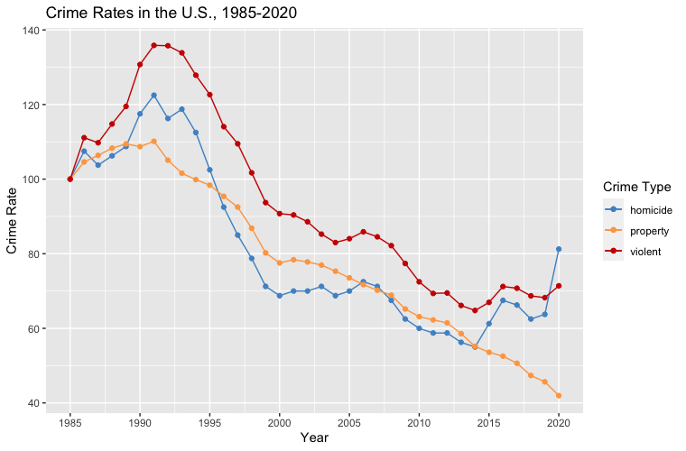
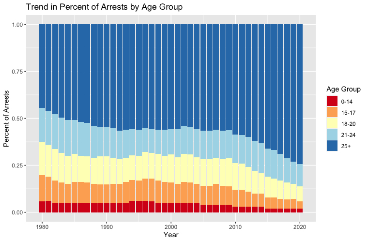
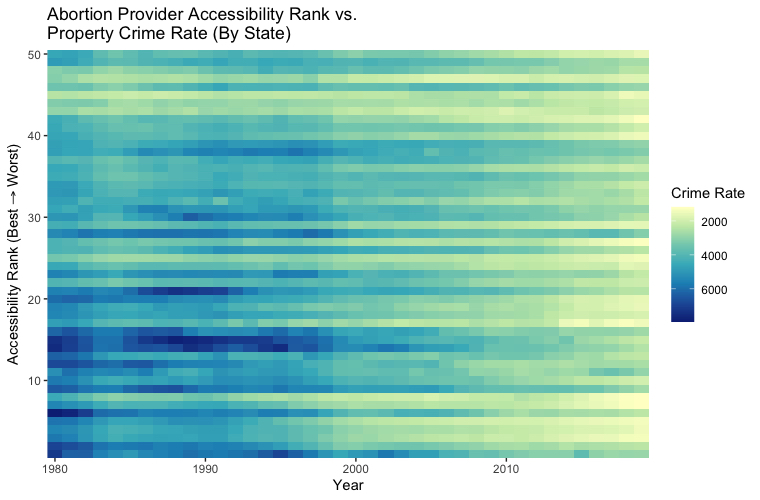

Reference: [FBI Crime Data Explorer](https://crime-data-explorer.app.cloud.gov/pages/explorer/crime/crime-trend)

Pictured above are crime rates in the US from 1985 to 2020. We start to observe a decline in crime around 1991, which is 18 years after the legalization of abortion. This is when children, of mothers who had first access to legal abortion, are at an age where crime rates peak. This leads us to wonder, are children born to parents with the right to an abortion, less likely to commit crimes? The following slides demonstate why this relationship may be more than a coincidence. 

Reference: [FBI Crime Data Explorer](https://crime-data-explorer.app.cloud.gov/pages/explorer/crime/property-crime)

Five states (Alaska, California, Hawaii, New York, and Washington) legalized abortion three years prior to Roe v. Wade. We observe property crime falling 3 years earlier in these states.

Reference: [OJJDP](https://www.ojjdp.gov/ojstatbb/crime/ucr_trend.asp?table_in=1&selOffenses=1&rdoGroups=1&rdoDataType=2)

During the mid 90s we see a slight persisting decrease in the percent of crime commited by ages 0-20. In 2010 we see a steeper decrease which also includes 21-24 age group.

Reference: [Guttmacher Institute](https://data.guttmacher.org/states)

I rated all of the states by percentage of women aged 15-44 living in a county without an abortion provider. I then compared these rankings with the property crime rates from 1980 to 2020. We see that states with better rankings have a more siginificant decrease in property crime rates.

Reference: [Guttmacher Institute](https://data.guttmacher.org/states)

I compared the abortion provider accessability rankings with the violent crime rates from 1980 to 2020. We see that states with better rankings have a more siginificant decrease in violent crime rates.