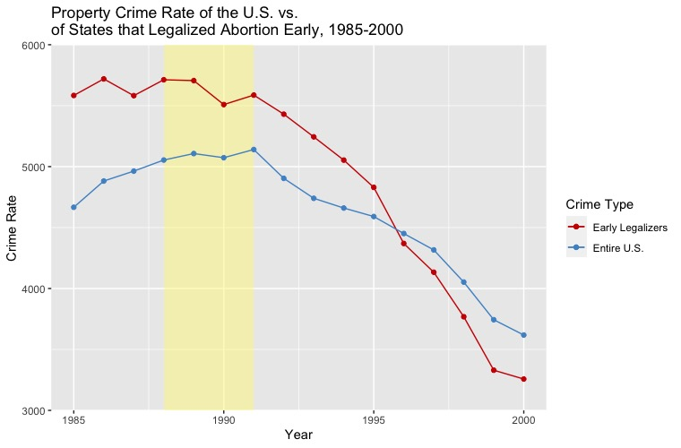
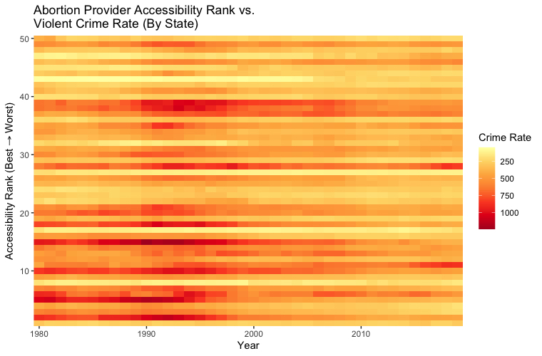

Roe v. Wade was a 1973 Supreme Court case that focused on whether abortion can be legalized nationally. For early pregnancy, the court decided that a mother’s interest outweighs any other decision about prenatal life. Once a fetus is able to survive outside of the womb, however, after 24-28 weeks of conception, the SC ruled that state decisions will outweigh the mother’s personal interest. Ultimately, the case declared that abortion is allowed until a fetus can live outside of the womb, which is past the point of viability. 

Prior to this, five individual states all had deemed laws that banned abortion to be unconstitutional as of 1970, and the Sumpreme Court’s decision three years later extended this legalization to the rest of the country. 

Documented abortions rose sharply after Roe, with over 1.6 million just seven years after - which equates to about 1 abortion for every 2 live births - and the cost of an abortion dropped considerably after its legalization. For any illegal abortions before Roe, the cost of travel, and any risky procedures was also reduced after this legalization.

Reference: [FBI Crime Data Explorer](https://crime-data-explorer.app.cloud.gov/pages/explorer/crime/crime-trend)

Pictured above are crime rates in the US from 1985 to 2020. We start to observe a decline in crime around 1991, which is 18 years after the legalization of abortion. This is when children, of mothers who had first access to legal abortion, are at an age where crime rates peak. This leads us to wonder, are children born to parents with the right to an abortion, less likely to commit crimes? The following slides demonstate why this relationship may be more than a coincidence. 

Reference: [FBI Crime Data Explorer](https://crime-data-explorer.app.cloud.gov/pages/explorer/crime/property-crime)

Five states (Alaska, California, Hawaii, New York, and Washington) legalized abortion three years prior to Roe v. Wade. We observe property crime falling 3 years earlier in these states.

Reference: [OJJDP](https://www.ojjdp.gov/ojstatbb/crime/ucr_trend.asp?table_in=1&selOffenses=1&rdoGroups=1&rdoDataType=2)

During the mid 90s we see a slight persisting decrease in the percent of crime commited by ages 0-20. In 2010 we see a steeper decrease which also includes 21-24 age group.

Reference: [Guttmacher Institute](https://data.guttmacher.org/states)

I rated all of the states by percentage of women aged 15-44 living in a county without an abortion provider. I then compared these rankings with the property crime rates from 1980 to 2020. We see that states with better rankings have a more siginificant decrease in property crime rates.

Reference: [Guttmacher Institute](https://data.guttmacher.org/states)

I compared the abortion provider accessability rankings with the violent crime rates from 1980 to 2020. We see that states with better rankings have a more siginificant decrease in violent crime rates.

Ultimately, its difficult to deny that the data indicates some decline in crime associated with the 1973 court case known as Roe v. Wade. 
In fact, Donohue and Levitt’s 2019 study suggests that abortion explains 80 to 90 percent of all decline in crime over the last 30 years, due to its compounding impact over time. The idea also makes intuitive sense- if children are unwanted they are less likely to be born into loving and supportive households, which may increase their likelihood of being involved in crimes. 

But this is not intended to be a reason to change your beliefs regarding legalized abortion. Instead it is a way to realize the factors that impact crime the most. It seems that if ones goal reducing crime, they should figure out how to make children feel wanted. This is not necessarily only by means of legalized abortion. One could consider, training for parents, better early education, or maybe minimum incomes. The point is, these studies lead us to ask the right questions, and shift our focus to a more productive discussion when it comes to reducing crime.
Reference: [National Bureau of Economic Research](https://www.nber.org/system/files/working_papers/w25863/w25863.pdf)